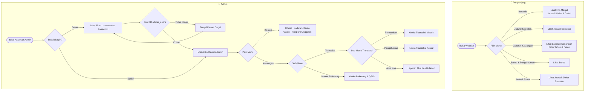
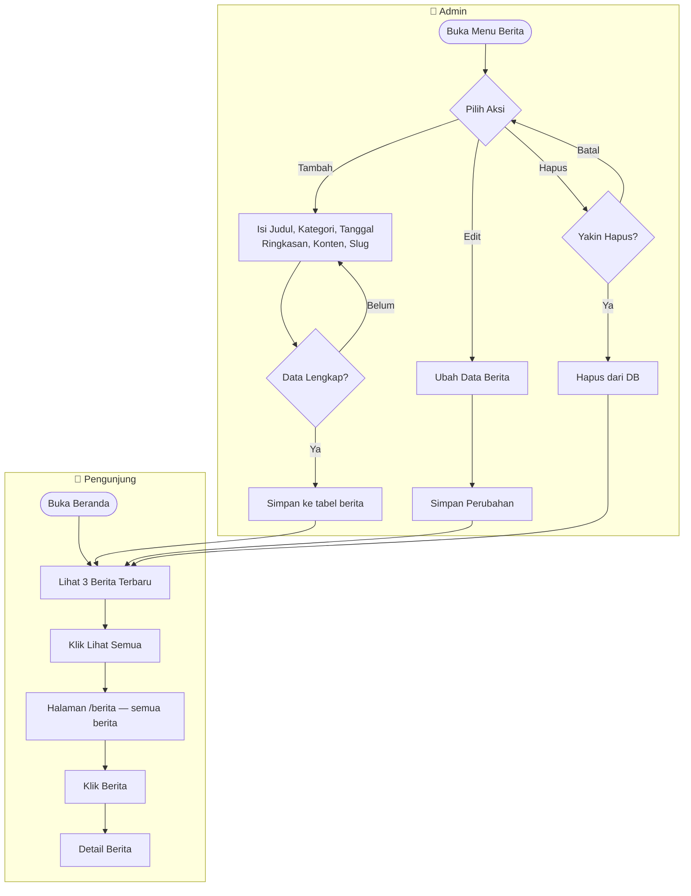
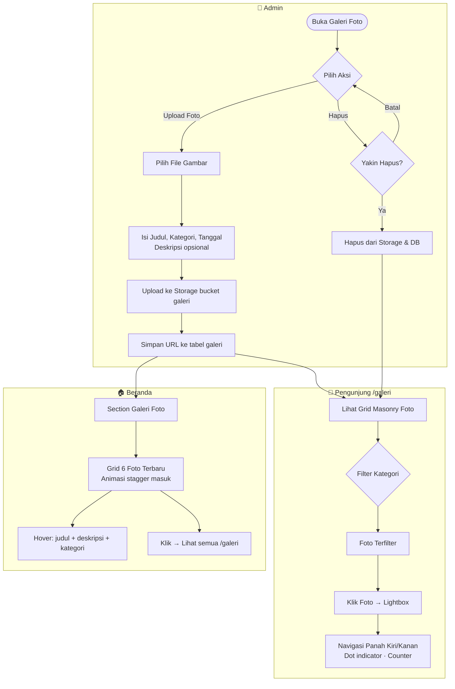
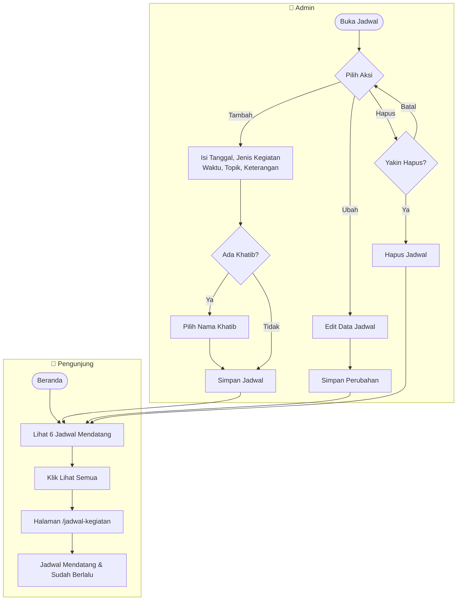
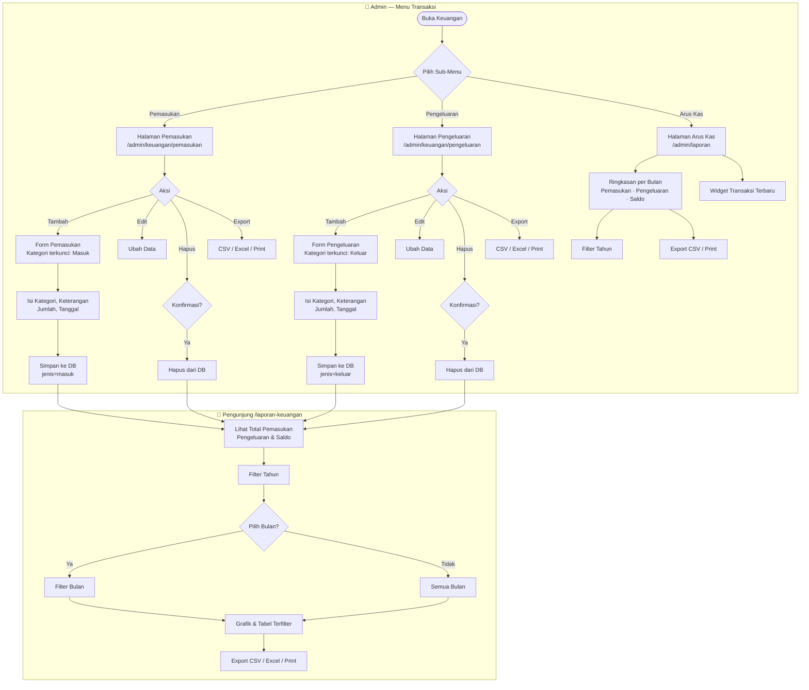
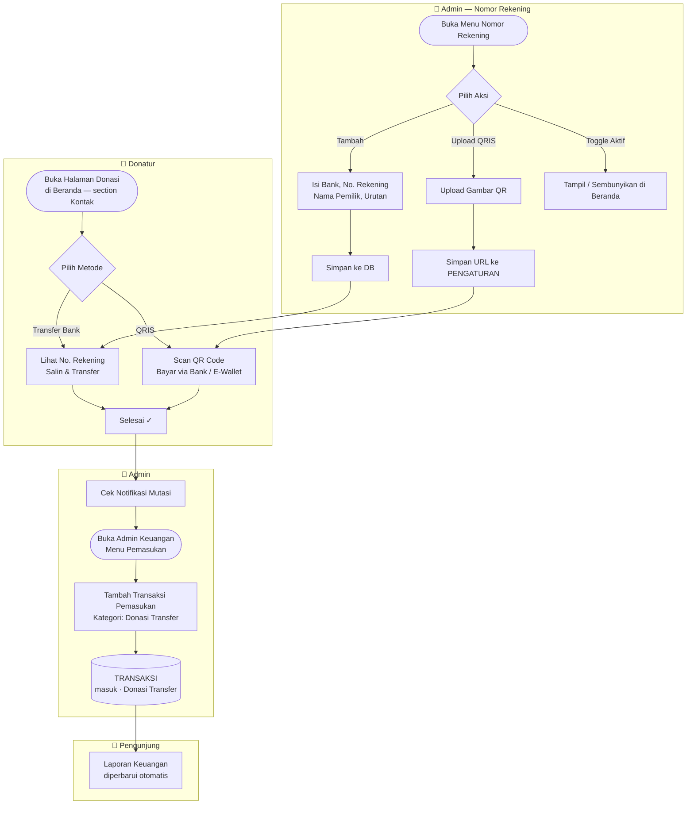
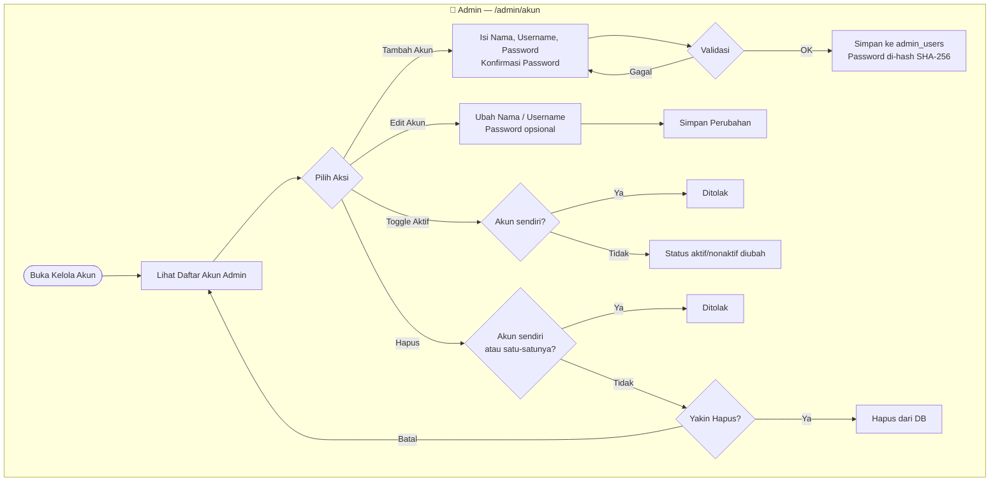

```mermaid
erDiagram
    KHATIB {
        uuid    id           PK "Primary Key"
        text    nama         "NOT NULL"
        text    gelar        "default: kosong"
        text    spesialisasi "default: kosong"
        text    no_hp        "default: kosong"
        text    email        "default: kosong"
        boolean aktif        "default: true"
        text    foto_url     "nullable"
    }

    JADWAL {
        uuid id             PK "Primary Key"
        date tanggal        "NOT NULL"
        text jenis_kegiatan "NOT NULL"
        uuid khatib_id      FK "nullable — ON DELETE SET NULL"
        text topik          "default: kosong"
        text waktu          "format HH:MM"
        text keterangan     "default: kosong"
    }

    TRANSAKSI {
        uuid   id          PK "Primary Key"
        date   tanggal     "NOT NULL"
        text   keterangan  "NOT NULL"
        text   kategori    "NOT NULL"
        text   jenis       "CHECK: masuk | keluar"
        bigint jumlah      "dalam Rupiah, CHECK: > 0"
    }

    REKENING {
        uuid    id      PK "Primary Key"
        text    bank    "NOT NULL"
        text    norek   "NOT NULL"
        text    atas    "NOT NULL — nama pemilik rekening"
        integer urutan  "default: 0 — urutan tampil"
        boolean aktif   "default: true"
    }

    PENGATURAN {
        text key   PK "Primary Key"
        text value "nullable — nilai setting"
    }

    BERITA {
        uuid        id         PK "Primary Key"
        text        slug       "UNIQUE NOT NULL — URL-friendly"
        text        judul      "NOT NULL"
        text        ringkasan  "default: kosong"
        text        konten     "default: kosong — isi artikel"
        text        kategori   "default: Pengumuman"
        date        tanggal    "NOT NULL default: today"
        timestamptz created_at "default: now()"
    }

    GALERI {
        uuid        id         PK "Primary Key"
        text        judul      "NOT NULL"
        text        deskripsi  "default: kosong"
        text        image_url  "NOT NULL — URL dari Storage"
        text        kategori   "default: Kegiatan"
        date        tanggal    "NOT NULL default: today"
        timestamptz created_at "default: now()"
    }

    PROGRAM_IMAGES {
        text        key        PK "Primary Key — slug program"
        text        image_url  "nullable — URL dari Storage"
        timestamptz updated_at "auto-update on change"
    }

    ADMIN_USERS {
        uuid        id            PK "Primary Key"
        text        username      "UNIQUE NOT NULL"
        text        password_hash "NOT NULL — SHA-256 hex"
        text        nama          "default: kosong"
        boolean     aktif         "default: true"
        timestamptz created_at    "default: now()"
    }

    KHATIB ||--o{ JADWAL : "mengisi"
```

# Entity Relationship Diagram — Sistem Informasi Masjid Al-Hidayah

**Lokasi:** Ketintang Baru XV No.20, Kec. Gayungan, Surabaya
**Database:** PostgreSQL (Supabase)
**Diperbarui:** Mei 2026

---

---

## Keterangan Tabel

### KHATIB

Menyimpan data penceramah/khatib yang terdaftar di masjid.

| Kolom          | Tipe    | Keterangan                                |
| -------------- | ------- | ----------------------------------------- |
| `id`           | UUID    | Primary key, di-generate otomatis         |
| `nama`         | TEXT    | Nama lengkap khatib                       |
| `gelar`        | TEXT    | Gelar akademik (contoh: Lc., M.A.)        |
| `spesialisasi` | TEXT    | Bidang keahlian (contoh: Tafsir & Hadist) |
| `no_hp`        | TEXT    | Nomor handphone                           |
| `email`        | TEXT    | Alamat email                              |
| `aktif`        | BOOLEAN | Status aktif/tidak aktif                  |
| `foto_url`     | TEXT    | URL foto dari Storage (opsional)          |

---

### JADWAL

Menyimpan jadwal kegiatan masjid (khutbah, kajian, TPA, dll).

| Kolom            | Tipe | Keterangan                                 |
| ---------------- | ---- | ------------------------------------------ |
| `id`             | UUID | Primary key, di-generate otomatis          |
| `tanggal`        | DATE | Tanggal kegiatan (YYYY-MM-DD)              |
| `jenis_kegiatan` | TEXT | Jenis kegiatan (lihat enum di bawah)       |
| `khatib_id`      | UUID | Foreign key ke tabel KHATIB (boleh kosong) |
| `topik`          | TEXT | Topik/tema kegiatan                        |
| `waktu`          | TEXT | Jam kegiatan format HH:MM                  |
| `keterangan`     | TEXT | Catatan tambahan                           |

---

### TRANSAKSI

Menyimpan seluruh transaksi keuangan masjid (pemasukan & pengeluaran).

| Kolom        | Tipe   | Keterangan                                  |
| ------------ | ------ | ------------------------------------------- |
| `id`         | UUID   | Primary key, di-generate otomatis           |
| `tanggal`    | DATE   | Tanggal transaksi (YYYY-MM-DD)              |
| `keterangan` | TEXT   | Deskripsi transaksi                         |
| `kategori`   | TEXT   | Kategori transaksi (lihat enum di bawah)    |
| `jenis`      | TEXT   | `masuk` = pemasukan, `keluar` = pengeluaran |
| `jumlah`     | BIGINT | Nominal dalam Rupiah (harus > 0)            |

---

### REKENING

Menyimpan nomor rekening bank untuk halaman donasi/wakaf yang ditampilkan di halaman publik.

| Kolom    | Tipe    | Keterangan                                    |
| -------- | ------- | --------------------------------------------- |
| `id`     | UUID    | Primary key, di-generate otomatis             |
| `bank`   | TEXT    | Nama bank (contoh: BSI, Mandiri Syariah)      |
| `norek`  | TEXT    | Nomor rekening                                |
| `atas`   | TEXT    | Nama pemilik rekening                         |
| `urutan` | INTEGER | Urutan tampil di halaman (angka kecil = atas) |
| `aktif`  | BOOLEAN | Jika false, rekening disembunyikan dari publik |

---

### PENGATURAN

Menyimpan konfigurasi global sistem (key-value). Digunakan untuk menyimpan URL gambar QRIS donasi.

| Kolom   | Tipe | Keterangan                                      |
| ------- | ---- | ----------------------------------------------- |
| `key`   | TEXT | Primary key (contoh: `qris_url`)                |
| `value` | TEXT | Nilai setting, misal URL gambar QRIS (nullable) |

---

### BERITA

Menyimpan artikel berita dan pengumuman yang dikelola admin dan ditampilkan di halaman publik.

| Kolom        | Tipe        | Keterangan                                                       |
| ------------ | ----------- | ---------------------------------------------------------------- |
| `id`         | UUID        | Primary key, di-generate otomatis                                |
| `slug`       | TEXT        | URL-friendly identifier, unik (contoh: `kajian-sabtu-mei-2026`) |
| `judul`      | TEXT        | Judul berita/pengumuman                                          |
| `ringkasan`  | TEXT        | Ringkasan singkat untuk preview card                             |
| `konten`     | TEXT        | Isi artikel lengkap (paragraf dipisah dengan baris kosong)       |
| `kategori`   | TEXT        | Pengumuman / Kajian / Pendidikan / Infrastruktur / Sosial / Renovasi |
| `tanggal`    | DATE        | Tanggal publikasi (YYYY-MM-DD)                                   |
| `created_at` | TIMESTAMPTZ | Waktu data dibuat                                                |

---

### GALERI

Menyimpan foto dokumentasi kegiatan masjid yang dikelola admin dan ditampilkan di halaman galeri publik maupun preview di beranda.

| Kolom        | Tipe        | Keterangan                                                |
| ------------ | ----------- | --------------------------------------------------------- |
| `id`         | UUID        | Primary key, di-generate otomatis                         |
| `judul`      | TEXT        | Judul/nama foto                                           |
| `deskripsi`  | TEXT        | Deskripsi foto (opsional, tampil saat hover di beranda)   |
| `image_url`  | TEXT        | URL publik dari Supabase Storage bucket `galeri`          |
| `kategori`   | TEXT        | Kegiatan / Kajian / Renovasi / Sosial / Ramadan / Lainnya |
| `tanggal`    | DATE        | Tanggal foto diambil                                      |
| `created_at` | TIMESTAMPTZ | Waktu data dibuat                                         |

---

### PROGRAM_IMAGES

Menyimpan URL foto untuk masing-masing program unggulan masjid yang ditampilkan di halaman beranda.

| Kolom        | Tipe        | Keterangan                                               |
| ------------ | ----------- | -------------------------------------------------------- |
| `key`        | TEXT        | Primary key — slug program (contoh: `tpa-al-hidayah`)   |
| `image_url`  | TEXT        | URL publik dari Supabase Storage bucket `program-images` |
| `updated_at` | TIMESTAMPTZ | Auto-update setiap kali data diubah                      |

**Nilai `key` yang tersedia:**

| key               | Program          |
| ----------------- | ---------------- |
| `tpa-al-hidayah`  | TPA Al-Hidayah   |
| `kajian-sabtu`    | Kajian Sabtu     |
| `wakaf-produktif` | Wakaf Produktif  |
| `tahsin-alquran`  | Tahsin Al-Qur'an |

---

### ADMIN_USERS

Menyimpan akun admin yang dapat mengakses panel administrasi. Password disimpan sebagai hash SHA-256.

| Kolom           | Tipe        | Keterangan                                          |
| --------------- | ----------- | --------------------------------------------------- |
| `id`            | UUID        | Primary key, di-generate otomatis                   |
| `username`      | TEXT        | Username unik untuk login (lowercase, tanpa spasi)  |
| `password_hash` | TEXT        | Hash SHA-256 dari password                          |
| `nama`          | TEXT        | Nama lengkap admin (untuk tampilan sidebar)         |
| `aktif`         | BOOLEAN     | Jika false, akun tidak bisa login                   |
| `created_at`    | TIMESTAMPTZ | Waktu akun dibuat                                   |

> Migration: `supabase/migration_admin_users.sql` — seed otomatis akun `admin` / `admin123`

---

## Relasi Antar Tabel

| Relasi          | Tipe                   | Keterangan                                                                                                                   |
| --------------- | ---------------------- | ---------------------------------------------------------------------------------------------------------------------------- |
| KHATIB → JADWAL | One-to-Many (opsional) | Satu khatib dapat mengisi banyak jadwal. Jika khatib dihapus, kolom `khatib_id` di jadwal menjadi NULL (ON DELETE SET NULL) |

> Tabel **REKENING**, **PENGATURAN**, **BERITA**, **GALERI**, **PROGRAM_IMAGES**, dan **ADMIN_USERS** berdiri sendiri tanpa relasi ke tabel lain.

---

## Nilai Enum

### Jenis Transaksi (`transaksi.jenis`)

| Nilai    | Keterangan                   |
| -------- | ---------------------------- |
| `masuk`  | Pemasukan / penerimaan kas   |
| `keluar` | Pengeluaran / pembayaran kas |

### Kategori Pemasukan (`transaksi.kategori`)

| Kategori        |
| --------------- |
| Infaq Jumat     |
| Kotak Amal      |
| Donasi Transfer |
| Wakaf           |
| Zakat           |

### Kategori Pengeluaran (`transaksi.kategori`)

| Kategori               |
| ---------------------- |
| Listrik & Air          |
| Kebersihan             |
| Operasional            |
| Kajian & Kegiatan      |
| Pembangunan & Renovasi |

### Jenis Kegiatan (`jadwal.jenis_kegiatan`)

| Jenis Kegiatan           |
| ------------------------ |
| Khutbah Jumat            |
| Kajian Sabtu             |
| Tahsin Al-Qur'an         |
| TPA Al-Hidayah           |
| Pengajian                |
| Maulid & Kegiatan Khusus |

### Kategori Berita (`berita.kategori`)

| Kategori      |
| ------------- |
| Pengumuman    |
| Kajian        |
| Pendidikan    |
| Infrastruktur |
| Sosial        |
| Renovasi      |

### Kategori Galeri (`galeri.kategori`)

| Kategori |
| -------- |
| Kegiatan |
| Kajian   |
| Renovasi |
| Sosial   |
| Ramadan  |
| Lainnya  |

---

## Flowchart Alur Sistem

### 1. Alur Akses Website

---

### 2. Alur Berita & Pengumuman

---

### 3. Alur Galeri Foto

---

### 4. Alur Jadwal Kegiatan

---

### 5. Alur Keuangan

---

### 6. Alur Donasi

---

### 7. Alur Kelola Akun Admin *(belum diaktifkan)*

> Menu Pengaturan (Kelola Akun) sementara disembunyikan dari sidebar. Halaman `/admin/akun` masih ada dan bisa diakses langsung. Untuk mengaktifkan, uncomment bagian `Pengaturan` di `AdminSidebar.tsx`.

---

## Keamanan Data (Row Level Security)

Semua tabel menggunakan Row Level Security (RLS) Supabase.

| Tabel           | SELECT (baca)          | INSERT / UPDATE / DELETE          |
| --------------- | ---------------------- | --------------------------------- |
| khatib          | Publik                 | Hanya service role (server)       |
| jadwal          | Publik                 | Hanya service role (server)       |
| transaksi       | Publik                 | Hanya service role (server)       |
| rekening        | Publik                 | Hanya service role (server)       |
| pengaturan      | Publik                 | Hanya service role (server)       |
| berita          | Publik                 | Hanya service role (server)       |
| galeri          | Publik                 | Hanya service role (server)       |
| program_images  | Publik                 | Hanya service role (server)       |
| admin_users     | Hanya service role     | Hanya service role (server)       |

> `admin_users` tidak pernah diakses langsung dari client — selalu melalui API Route server-side yang menggunakan `SUPABASE_SERVICE_ROLE_KEY`.

---

## Storage Bucket (Supabase Storage)

| Bucket           | Digunakan oleh         | Isi                                   | Akses  | Status        |
| ---------------- | ---------------------- | ------------------------------------- | ------ | ------------- |
| `khatib-photos`  | Tabel `khatib`         | Foto profil khatib/ustadz             | Public | Aktif         |
| `qris`           | Tabel `pengaturan`     | Gambar QRIS donasi masjid             | Public | Aktif         |
| `program-images` | Tabel `program_images` | Foto program unggulan di beranda      | Public | Aktif         |
| `galeri`         | Tabel `galeri`         | Foto dokumentasi kegiatan masjid      | Public | Aktif         |

---

## Halaman Publik

| URL                 | Keterangan                                                    |
| ------------------- | ------------------------------------------------------------- |
| `/`                 | Beranda — jadwal sholat, kegiatan, galeri preview, berita, donasi & kontak |
| `/berita`           | Daftar semua berita & pengumuman                              |
| `/berita/[slug]`    | Detail berita                                                 |
| `/jadwal-kegiatan`  | Semua jadwal kegiatan mendatang & arsip                       |
| `/jadwal-sholat`    | Jadwal sholat bulanan Kota Surabaya                           |
| `/laporan-keuangan` | Laporan keuangan transparan + filter tahun & bulan + export   |
| `/galeri`           | Galeri foto kegiatan dengan filter kategori & lightbox        |

## Halaman Admin

| URL                              | Keterangan                                              | Status        |
| -------------------------------- | ------------------------------------------------------- | ------------- |
| `/admin/login`                   | Login dengan username & password (cek DB)               | Aktif         |
| `/admin/dashboard`               | Ringkasan statistik & transaksi terbaru                 | Aktif         |
| `/admin/khatib`                  | Kelola data khatib & ustadz                             | Aktif         |
| `/admin/jadwal`                  | Kelola jadwal kegiatan                                  | Aktif         |
| `/admin/berita`                  | Kelola berita & pengumuman                              | Aktif         |
| `/admin/galeri`                  | Upload & kelola foto galeri                             | Aktif         |
| `/admin/program`                 | Upload foto program unggulan                            | Aktif         |
| `/admin/keuangan`                | Redirect otomatis → /admin/keuangan/pemasukan           | Aktif         |
| `/admin/keuangan/pemasukan`      | Catat & kelola transaksi pemasukan                      | Aktif         |
| `/admin/keuangan/pengeluaran`    | Catat & kelola transaksi pengeluaran                    | Aktif         |
| `/admin/laporan`                 | Laporan alur kas bulanan + widget transaksi terbaru     | Aktif         |
| `/admin/rekening`                | Kelola nomor rekening & QRIS                            | Aktif         |
| `/admin/akun`                    | Kelola akun admin (tambah / edit / nonaktif / hapus)    | Belum dipakai |
