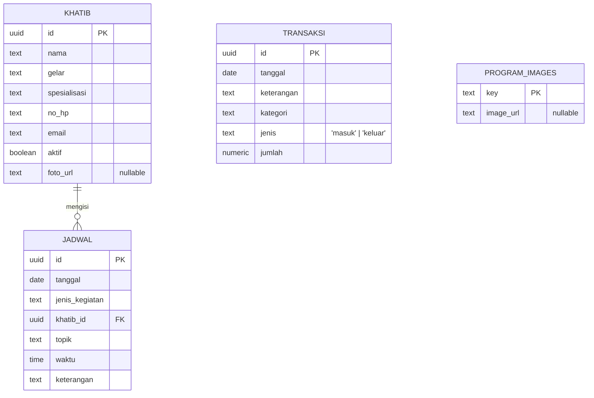

# ERD — Masjid Al-Hidayah



## Keterangan Relasi

| Relasi | Kardinalitas | Deskripsi |
|--------|-------------|-----------|
| `KHATIB` → `JADWAL` | 1 ke banyak (opsional) | Satu khatib bisa mengisi banyak jadwal; jadwal boleh tanpa khatib (`khatib_id` nullable) |

## Enum / Nilai Tetap

| Kolom | Nilai |
|-------|-------|
| `transaksi.jenis` | `masuk`, `keluar` |
| `transaksi.kategori` (masuk) | Infaq Jumat, Kotak Amal, Donasi Transfer, Wakaf, Zakat |
| `transaksi.kategori` (keluar) | Listrik & Air, Kebersihan, Operasional, Kajian & Kegiatan, Pembangunan & Renovasi |
| `jadwal.jenis_kegiatan` | Khutbah Jumat, Kajian Sabtu, Tahsin Al-Qur'an, Tahfidz, TPA Al-Hidayah, Maulid & Kegiatan Khusus |
```
