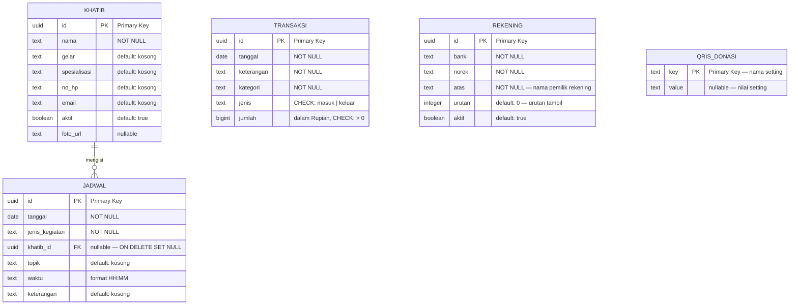
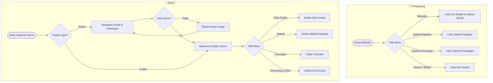
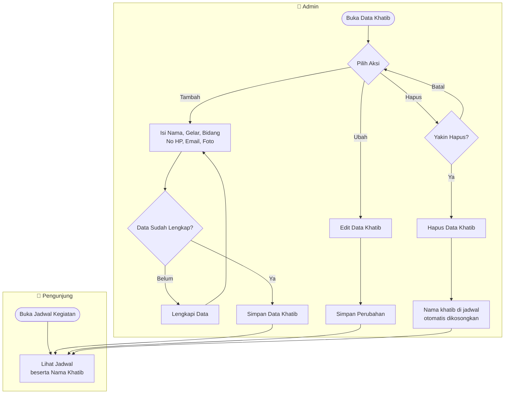
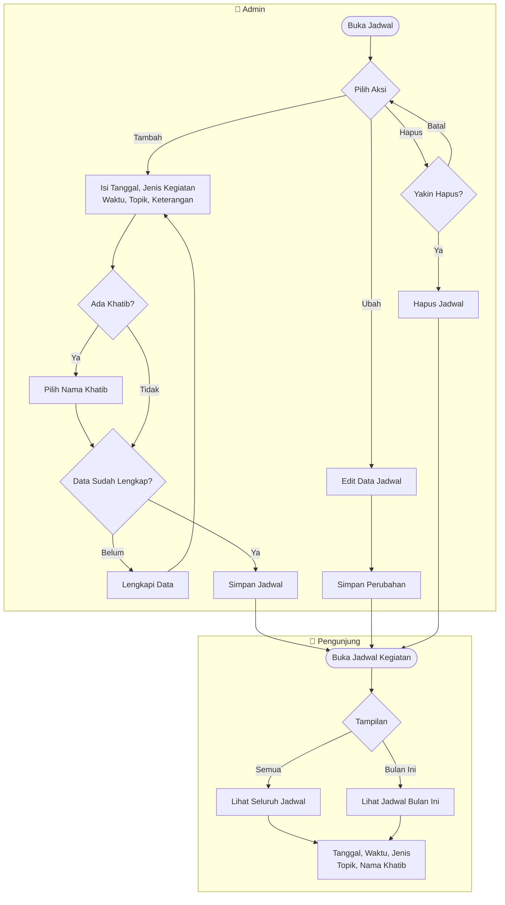
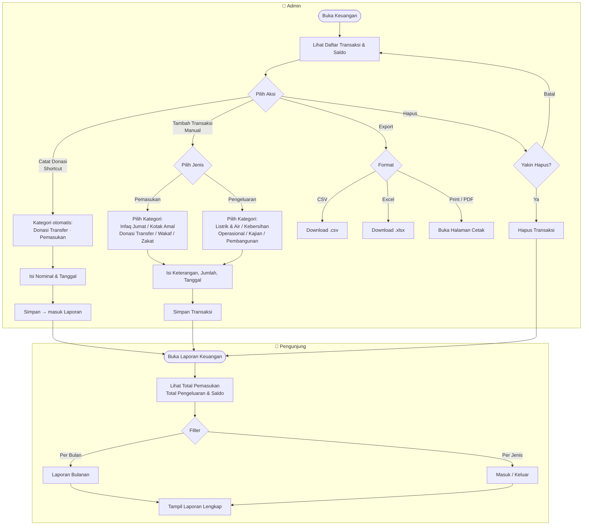
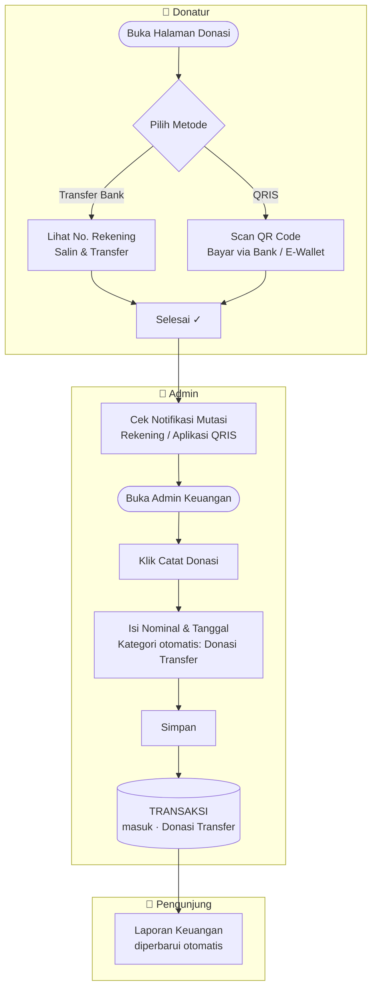
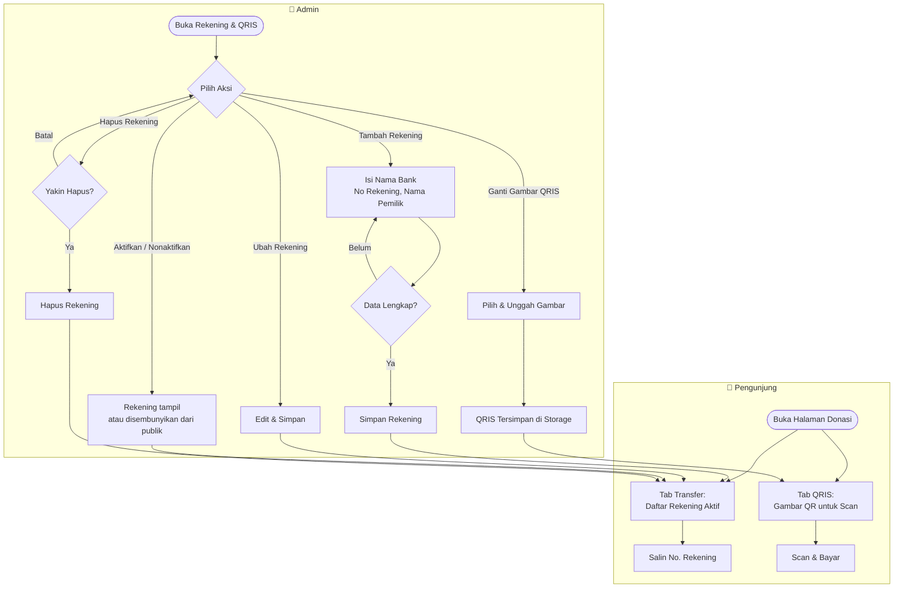

# Entity Relationship Diagram — Sistem Informasi Masjid Al-Hidayah

**Lokasi:** Ketintang Baru XV No.20, Kec. Gayungan, Surabaya
**Database:** PostgreSQL (Supabase)
**Dibuat:** April 2026

---

---

## Keterangan Tabel

### KHATIB

Menyimpan data penceramah/khatib yang terdaftar di masjid.

| Kolom          | Tipe       | Keterangan                                |
| -------------- | ---------- | ----------------------------------------- |
| `id`           | UUID       | Primary key, di-generate otomatis         |
| `nama`         | TEXT       | Nama lengkap khatib                       |
| `gelar`        | TEXT       | Gelar akademik (contoh: Lc., M.A.)        |
| `spesialisasi` | TEXT       | Bidang keahlian (contoh: Tafsir & Hadist) |
| `no_hp`        | TEXT       | Nomor handphone                           |
| `email`        | TEXT       | Alamat email                              |
| `aktif`        | BOOLEAN | Status aktif/tidak aktif                  |
| `foto_url`     | TEXT    | URL foto dari storage (opsional)          |

---

### JADWAL

Menyimpan jadwal kegiatan masjid (khutbah, kajian, TPA, dll).

| Kolom            | Tipe        | Keterangan                                 |
| ---------------- | ----------- | ------------------------------------------ |
| `id`             | UUID        | Primary key, di-generate otomatis          |
| `tanggal`        | DATE        | Tanggal kegiatan (YYYY-MM-DD)              |
| `jenis_kegiatan` | TEXT        | Jenis kegiatan (lihat enum di bawah)       |
| `khatib_id`      | UUID        | Foreign key ke tabel KHATIB (boleh kosong) |
| `topik`          | TEXT        | Topik/tema kegiatan                        |
| `waktu`          | TEXT        | Jam kegiatan format HH:MM                  |
| `keterangan`     | TEXT | Catatan tambahan |

---

### TRANSAKSI

Menyimpan seluruh transaksi keuangan masjid (pemasukan & pengeluaran).

| Kolom        | Tipe        | Keterangan                                  |
| ------------ | ----------- | ------------------------------------------- |
| `id`         | UUID        | Primary key, di-generate otomatis           |
| `tanggal`    | DATE        | Tanggal transaksi (YYYY-MM-DD)              |
| `keterangan` | TEXT        | Deskripsi transaksi                         |
| `kategori`   | TEXT        | Kategori transaksi (lihat enum di bawah)    |
| `jenis`      | TEXT        | `masuk` = pemasukan, `keluar` = pengeluaran |
| `jumlah`     | BIGINT | Nominal dalam Rupiah (harus > 0) |

---

### REKENING

Menyimpan nomor rekening bank untuk halaman donasi/wakaf. Data dikelola admin dan ditampilkan secara live di halaman publik.

| Kolom        | Tipe        | Keterangan                                        |
| ------------ | ----------- | ------------------------------------------------- |
| `id`         | UUID        | Primary key, di-generate otomatis                 |
| `bank`       | TEXT        | Nama bank (contoh: BSI, Mandiri Syariah)          |
| `norek`      | TEXT        | Nomor rekening                                    |
| `atas`       | TEXT        | Nama pemilik rekening                             |
| `urutan`     | INTEGER     | Urutan tampil di halaman (angka kecil = atas)     |
| `aktif`      | BOOLEAN | Jika false, rekening disembunyikan dari publik |

---

### QRIS_DONASI

Menyimpan URL gambar QRIS donasi masjid. Data dikelola admin dan ditampilkan di halaman donasi/wakaf publik.

| Kolom        | Tipe        | Keterangan                                              |
| ------------ | ----------- | ------------------------------------------------------- |
| `key`        | TEXT | Primary key (contoh: `qris_url`)                 |
| `value`      | TEXT | URL gambar QRIS dari Supabase Storage (nullable) |

**Contoh data:**

| key        | value                                      |
| ---------- | ------------------------------------------ |
| `qris_url` | `https://...supabase.co/storage/v1/...jpg` |

---

## Relasi Antar Tabel

| Relasi          | Tipe                   | Keterangan                                                                                                                   |
| --------------- | ---------------------- | ---------------------------------------------------------------------------------------------------------------------------- |
| KHATIB → JADWAL | One-to-Many (opsional) | Satu khatib dapat mengisi banyak jadwal. Jika khatib dihapus, kolom `khatib_id` di jadwal menjadi NULL (ON DELETE SET NULL) |

> **REKENING** dan **QRIS_DONASI** tidak memiliki relasi ke tabel lain — keduanya berdiri sendiri sebagai data master donasi.

---

## Nilai Enum

### Jenis Transaksi (`transaksi.jenis`)

| Nilai    | Keterangan                   |
| -------- | ---------------------------- |
| `masuk`  | Pemasukan / penerimaan kas   |
| `keluar` | Pengeluaran / pembayaran kas |

### Kategori Pemasukan (`transaksi.kategori`)

| Kategori        |
| --------------- |
| Infaq Jumat     |
| Kotak Amal      |
| Donasi Transfer |
| Wakaf           |
| Zakat           |

### Kategori Pengeluaran (`transaksi.kategori`)

| Kategori               |
| ---------------------- |
| Listrik & Air          |
| Kebersihan             |
| Operasional            |
| Kajian & Kegiatan      |
| Pembangunan & Renovasi |

### Jenis Kegiatan (`jadwal.jenis_kegiatan`)

| Jenis Kegiatan           |
| ------------------------ |
| Khutbah Jumat            |
| Kajian Sabtu             |
| Tahsin Al-Qur'an         |
| Tahfidz                  |
| TPA Al-Hidayah           |
| Maulid & Kegiatan Khusus |

---

## Flowchart Alur Sistem

### 1. Alur Akses Website

---

### 2. Alur Data Khatib

---

### 3. Alur Jadwal Kegiatan

---

### 4. Alur Keuangan

---

### 5. Alur Donasi → Laporan Keuangan

---

### 6. Alur Kelola Rekening & QRIS

---

## Keamanan Data (Row Level Security)

Semua tabel menggunakan Row Level Security (RLS) Supabase.

| Operasi                  | Hak Akses                         |
| ------------------------ | --------------------------------- |
| SELECT (baca)            | Publik — siapa saja dapat membaca |
| INSERT / UPDATE / DELETE | Hanya admin yang terautentikasi   |

---

## Storage Bucket (Supabase Storage)

| Bucket          | Isi                              | Akses  |
| --------------- | -------------------------------- | ------ |
| `khatib-photos` | Foto profil khatib/ustadz        | Public |
| `qris`          | Gambar QRIS donasi masjid        | Public |
| `program-images`| Foto program unggulan masjid     | Public |
