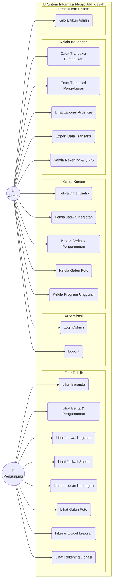
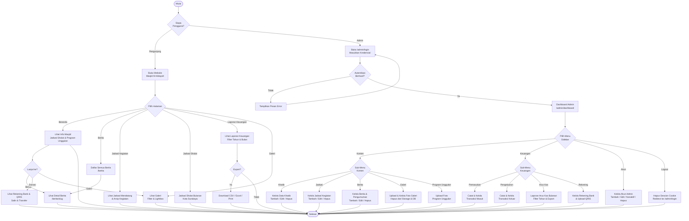
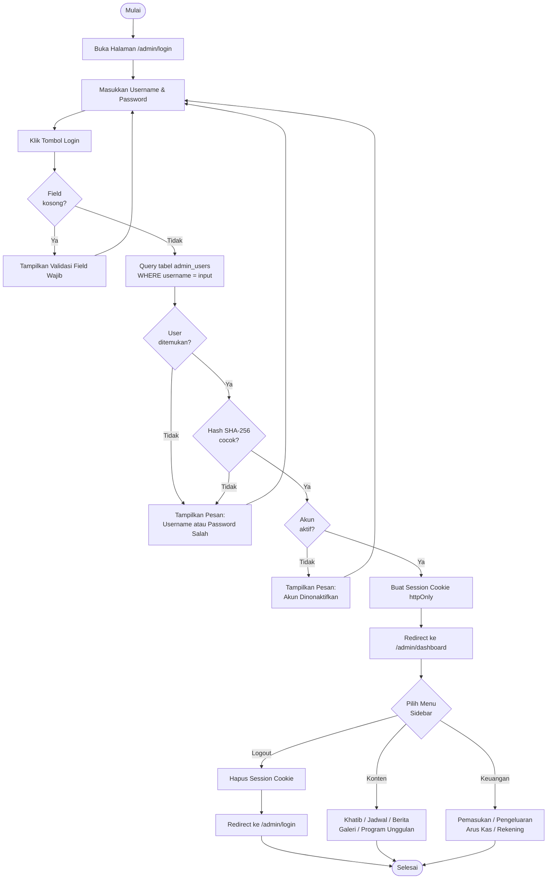
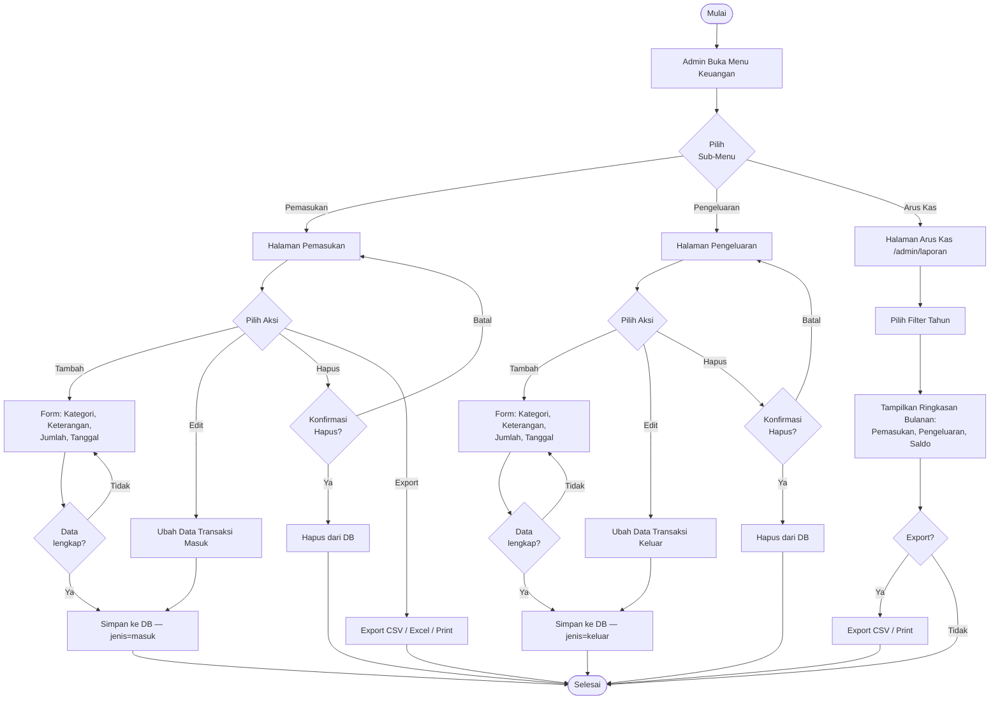
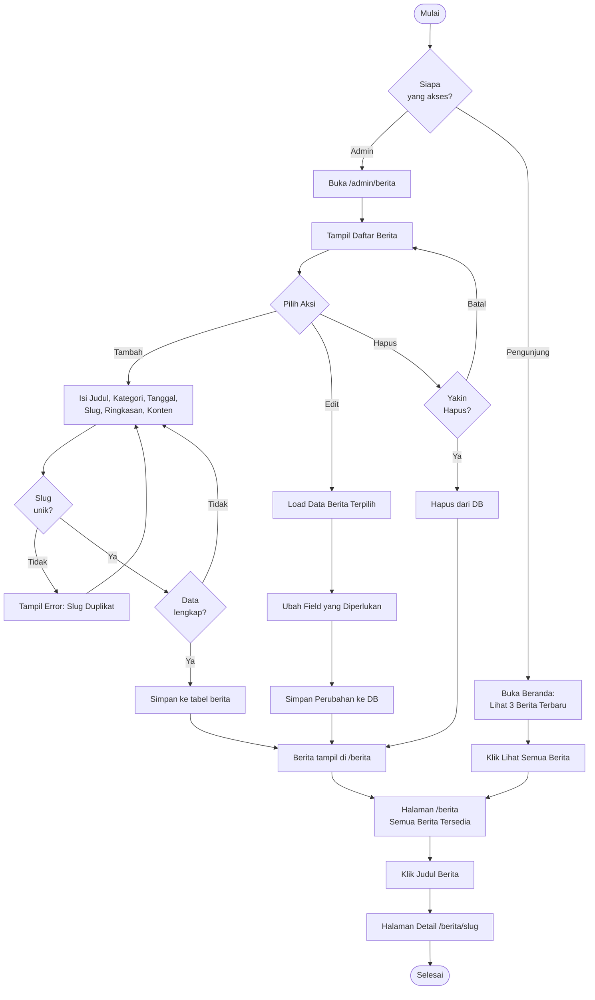
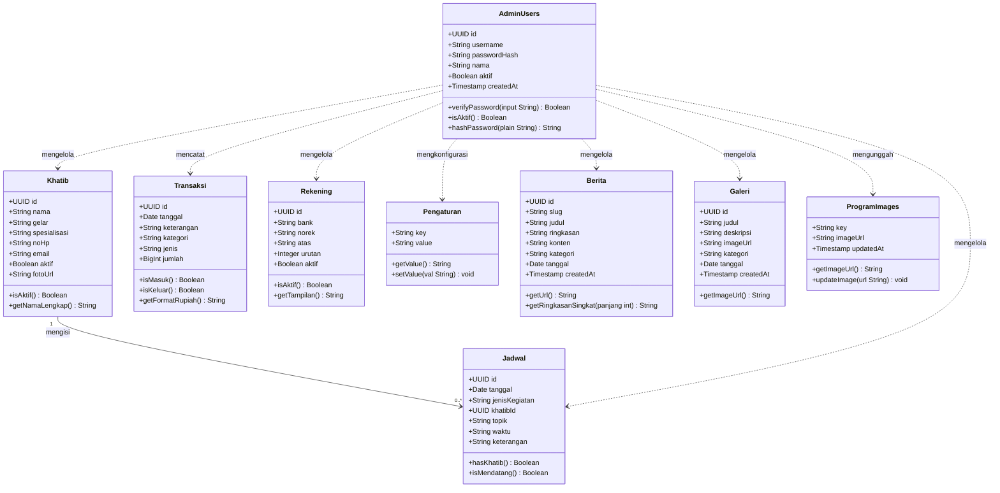

# UML Diagrams — Sistem Informasi Masjid Al-Hidayah

**Lokasi:** Ketintang Baru XV No.20, Kec. Gayungan, Surabaya
**Diperbarui:** Mei 2026

---

## 1. Use Case Diagram

### Aktor

| Aktor          | Deskripsi                                                      |
| -------------- | -------------------------------------------------------------- |
| **Pengunjung** | Pengguna publik yang mengakses halaman website tanpa login     |
| **Admin**      | Pengelola konten dan keuangan masjid yang telah terautentikasi |

---

## 2. Activity Diagrams

### 2.0 Activity Diagram: Gambaran Umum Sistem (Overview)

---

### 2.1 Activity Diagram: Login & Akses Dashboard Admin

---

### 2.2 Activity Diagram: Kelola Transaksi Keuangan

---

### 2.3 Activity Diagram: Kelola Berita & Akses Pengunjung

---

## 3. Class Diagram

---

## Ringkasan Use Case

| No | Use Case                    | Aktor      | Modul             |
|----|-----------------------------|------------|-------------------|
| 1  | Lihat Beranda               | Pengunjung | Publik            |
| 2  | Lihat Berita & Pengumuman   | Pengunjung | Publik            |
| 3  | Lihat Jadwal Kegiatan       | Pengunjung | Publik            |
| 4  | Lihat Jadwal Sholat         | Pengunjung | Publik            |
| 5  | Lihat Laporan Keuangan      | Pengunjung | Publik            |
| 6  | Lihat Galeri Foto           | Pengunjung | Publik            |
| 7  | Filter & Export Laporan     | Pengunjung | Publik            |
| 8  | Lihat Rekening Donasi       | Pengunjung | Publik            |
| 9  | Login Admin                 | Admin      | Autentikasi       |
| 10 | Logout                      | Admin      | Autentikasi       |
| 11 | Kelola Data Khatib          | Admin      | Kelola Konten     |
| 12 | Kelola Jadwal Kegiatan      | Admin      | Kelola Konten     |
| 13 | Kelola Berita & Pengumuman  | Admin      | Kelola Konten     |
| 14 | Kelola Galeri Foto          | Admin      | Kelola Konten     |
| 15 | Kelola Program Unggulan     | Admin      | Kelola Konten     |
| 16 | Catat Transaksi Pemasukan   | Admin      | Kelola Keuangan   |
| 17 | Catat Transaksi Pengeluaran | Admin      | Kelola Keuangan   |
| 18 | Lihat Laporan Arus Kas      | Admin      | Kelola Keuangan   |
| 19 | Export Data Transaksi       | Admin      | Kelola Keuangan   |
| 20 | Kelola Rekening & QRIS      | Admin      | Kelola Keuangan   |
| 21 | Kelola Akun Admin           | Admin      | Pengaturan Sistem |
